# DEPLOYMENT ASSIGNMENT
***
This Project in Millestone was succesfully deployed using Netlify. User can acces the website of Setup Consulting which the web contain is about Food Safety Program. People can apply and register to get a in-house training or audit program. The website that people can access is : ([https://set-up.my.id/](https://set-up.my.id/))

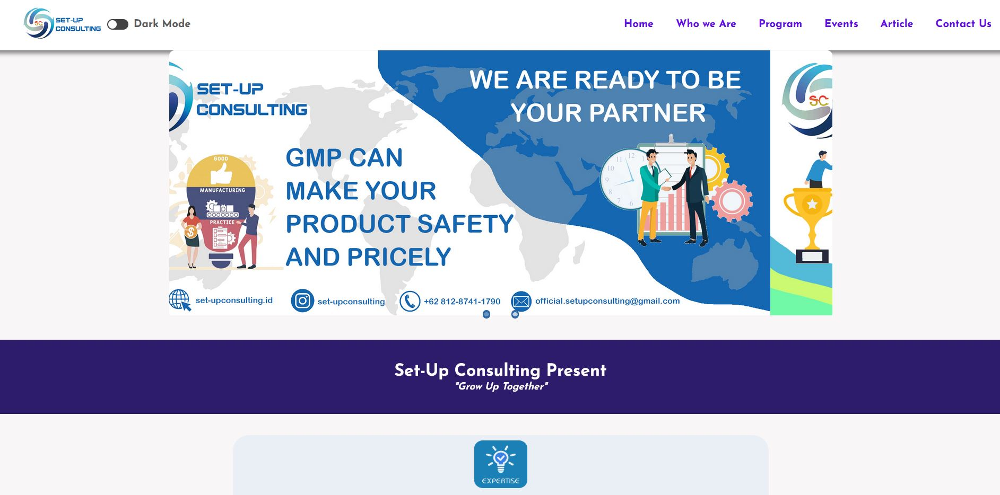
***
## Deployment Process
1. Go to ([https://www.netlify.com/](https://www.netlify.com/))
2. Login with your account if you already have account in netlify, or sign up to join and make account
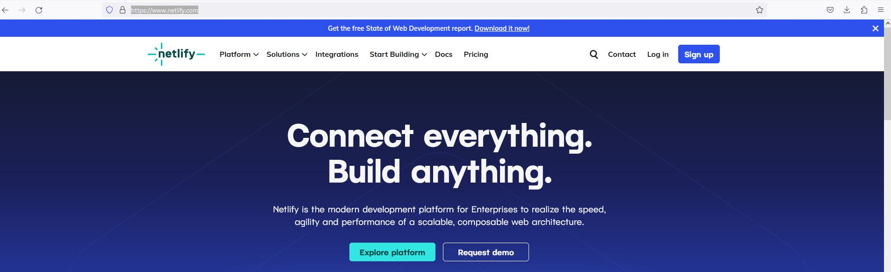
3. If You already have Git-hub account, you also can login with github account
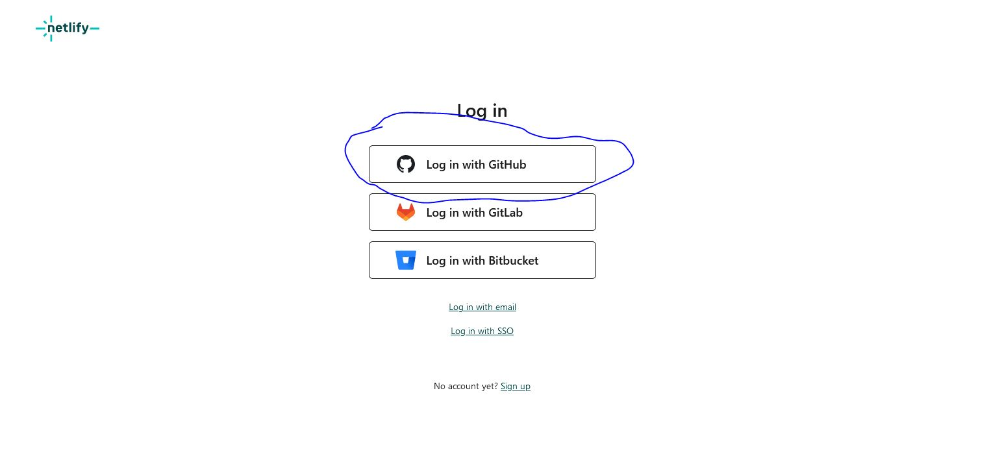
4. After login success, Netlify will bring you to main page
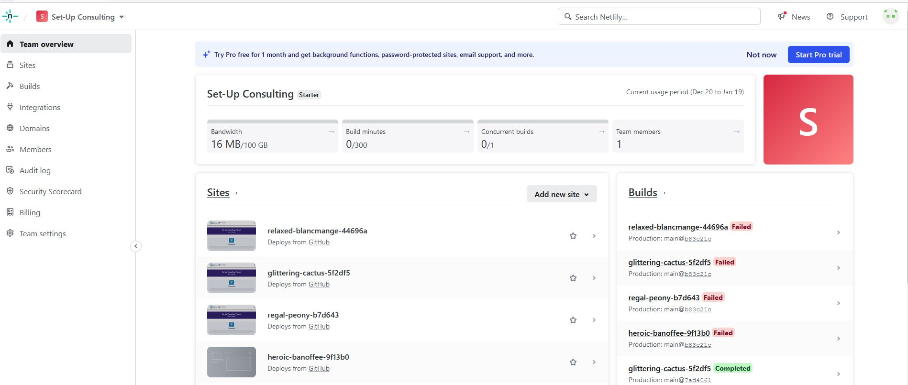
5. Choose Add new site and "Import an existing project"

6. Choose Deploy with GitHub
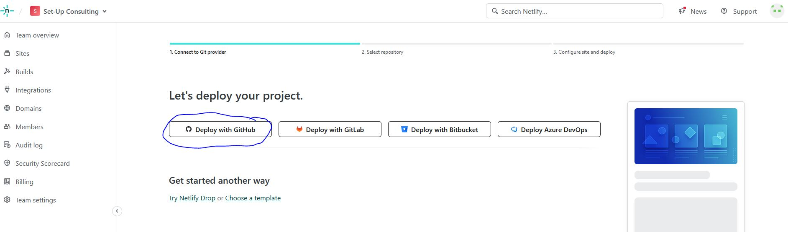
7. Select Your Github project

8. If you cannot see the repository of your github, choose "Configure the Netlify app on Github

9. Choose the repository in Github, example: "module-2-Amiril1424", Then Deploy the repository.
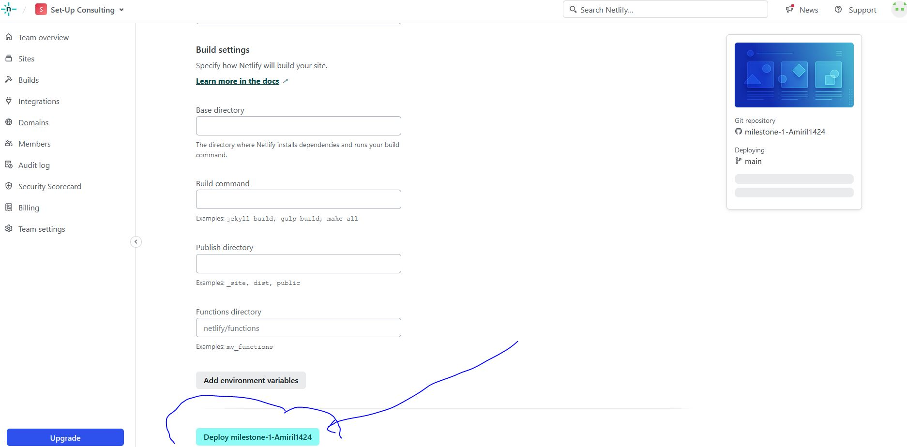
10. After finished Deploy, and success, you will get link of your web. You can access it
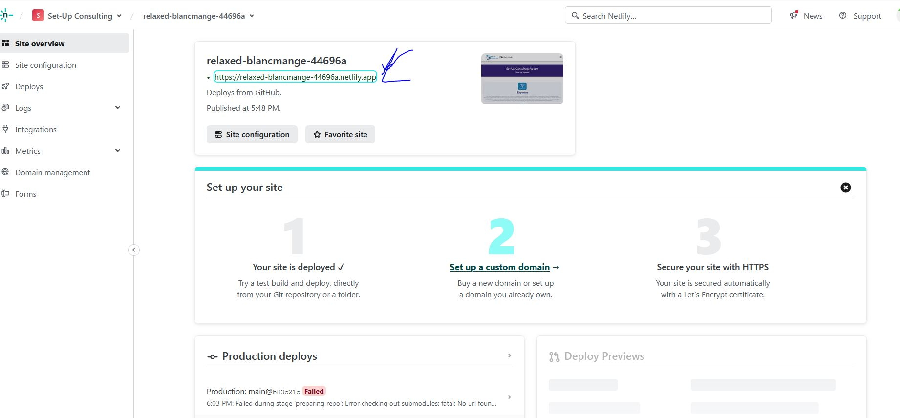

## How To Coonect Custome Domain and DNS
1. Go to ([https://www.niagahoster.co.id/](https://www.niagahoster.co.id/))

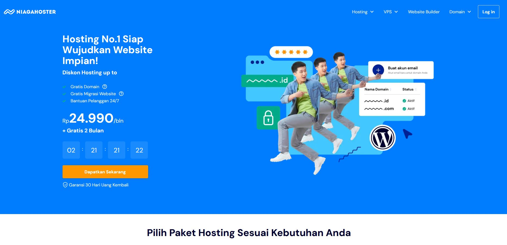

2. Login with google

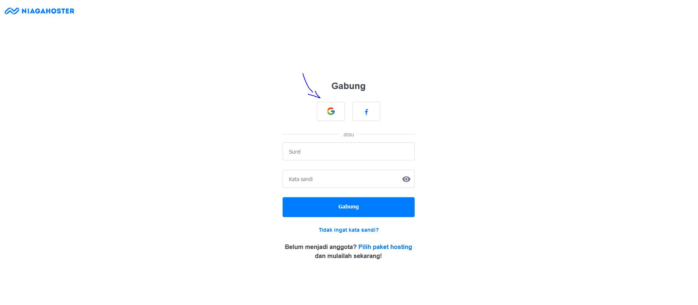

3. Choose Domain tab

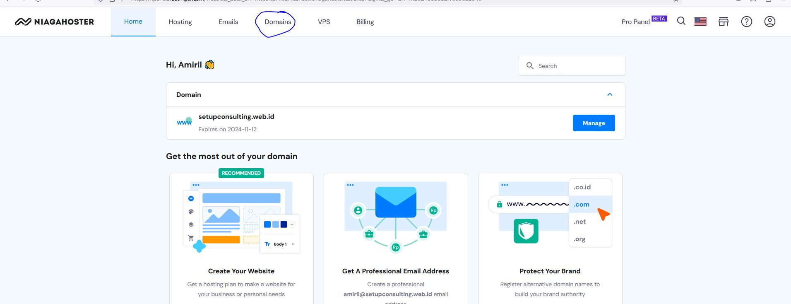

4. Search Domain name that you want

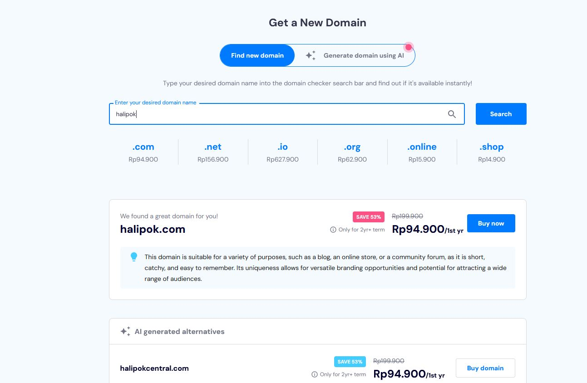

5. After finishing your payment, back to Niagahoster domain, and choose DNS / Nameservers

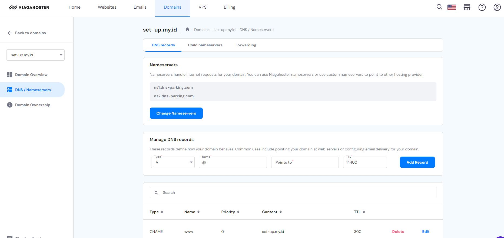
6. Copy and paste the domain name that you already made, and copy-paste target link from Netlify (delete "https://" and last slash in web address). Make sure you already choose CNAME for Type. After that, choose Add record

7. Back to Netlify, choose Domain management and Add a domain
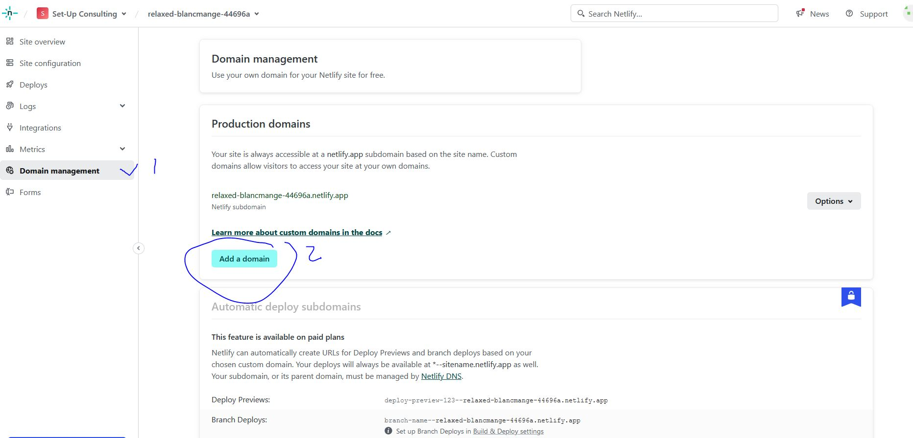

8. put your domain name and verify

9. Add Domain

10. Choose option in right side of domain and choose set-up Netlify DNS

11. Choose verify, Add domain, and continue. Don't Choose add record!!!
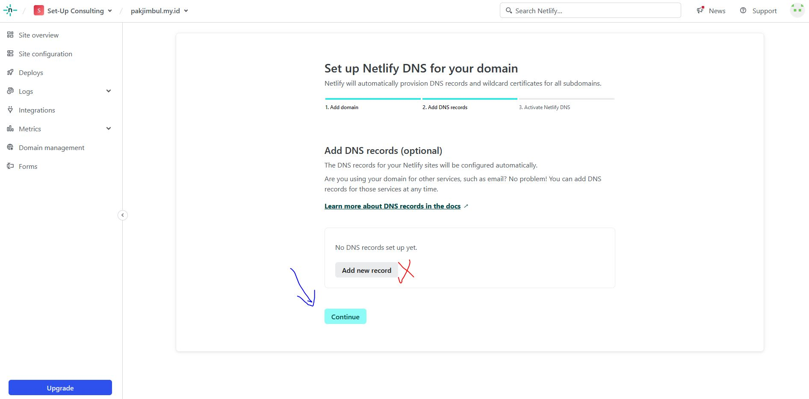

12. You Already have name servers, copy the DNS name. click DOne
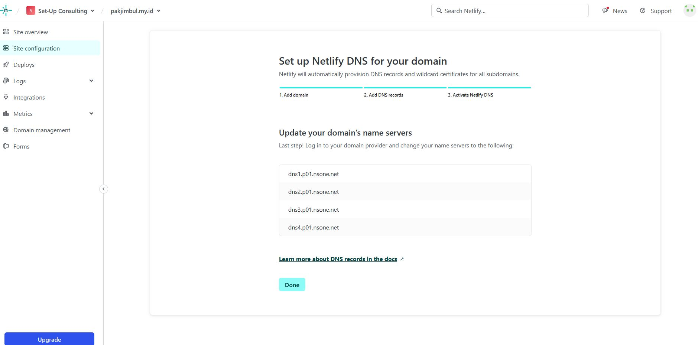

13. Back to Niagahoster, and change Name server

14. Paste the name server from Netlify, one by one
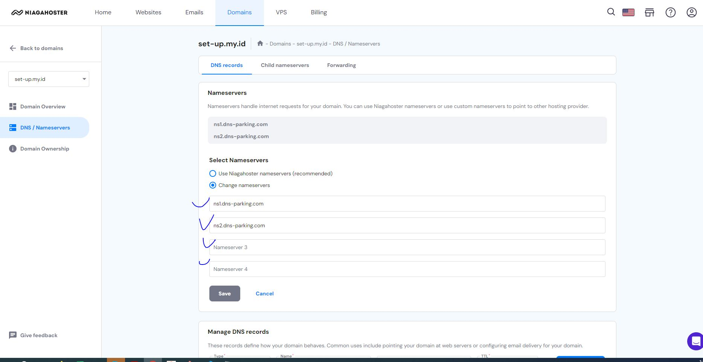

15. Niagahoster will need 24 hour for propagation process name server. but old netlify link still accessable.
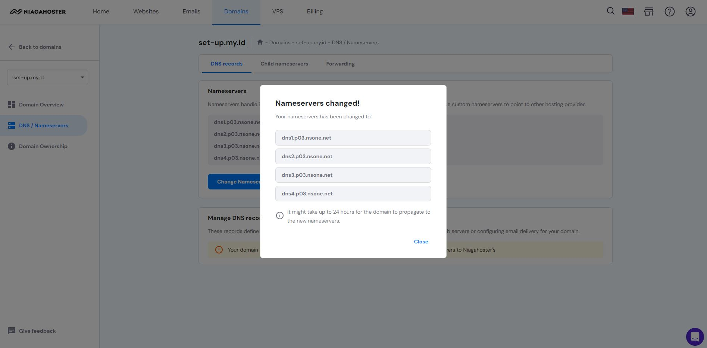
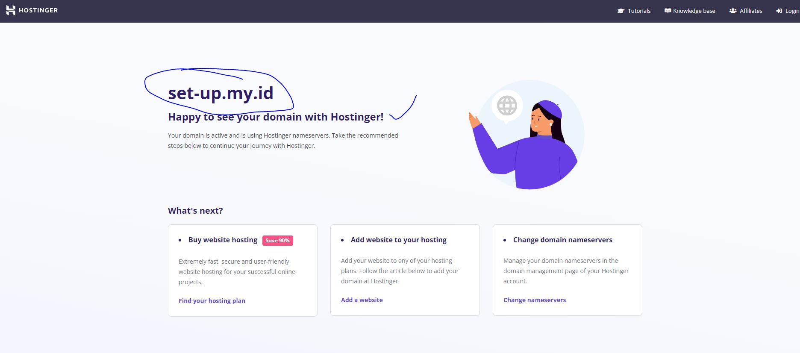

16. ### You already finished setting domain of your web.